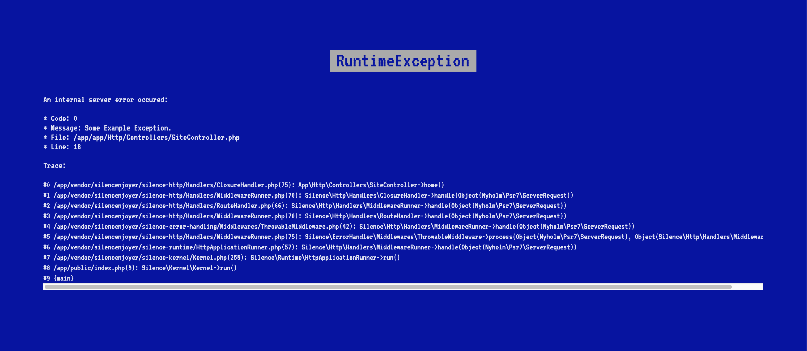

# Silence Error Handler

[](https://packagist.org/packages/silencenjoyer/silence-error-handling)
[](https://packagist.org/packages/silencenjoyer/silence-error-handling)
[](LICENSE)

The package is designed for centralised processing of errors and exceptions. It provides a readable view of errors.



This package is part of the monorepository [silencenjoyer/silence](https://github.com/silencenjoyer/silence), but can be used independently.

## ⚙️ Installation

``
composer require silencenjoyer/silence-error-handling
``

## 🚀 Quick start

```php
<?php

use Silence\ErrorHandler\ErrorHandler;
use Silence\ErrorHandler\Renderers\HtmlRenderer;

$errorHandler = new ErrorHandler(new HtmlRenderer());
$errorHandler->register();
```

## 🧱 Features:
- Interception of unhandled exceptions, compatible with PSR-15 middleware.
- Memory reserve to Avoid "Out of Memory" lockups
- Dynamic memory reserve adjustment
- Graceful fallback - When in non-debug mode, hides internal details.
- Detailed trace - When debug mode is enabled, provides full details.
- Shutdown error capture
- Unified rendering

## 🧪 Testing
``
php vendor/bin/phpunit
``

## 🧩 Use in the composition of Silence
The package is used to intercept errors in the Silence application.  
If you are writing your own package, you can connect ``silencenjoyer/silence-error-handling`` for the same reason.

## 📄 License
This package is distributed under the MIT licence. For more details, see [LICENSE](LICENSE).
